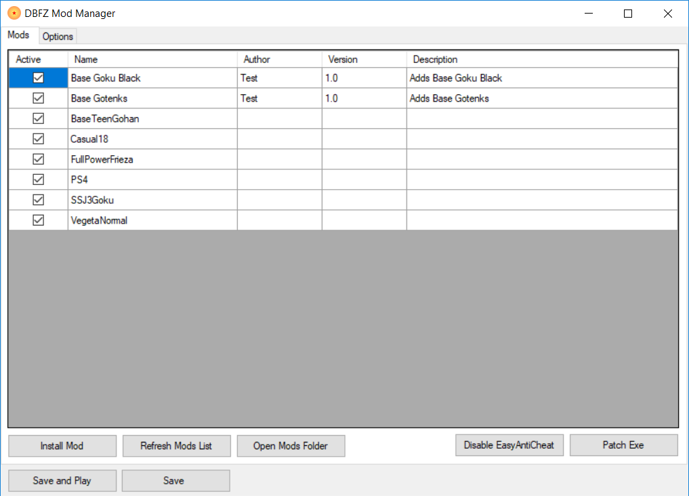

# DBFZ Mod Manager

A mod manager for Dragon Ball FighterZ.



## Disclaimer

Please use mods at your own risk and do not play online matches whilst mods are enabled!

## Patching the game

The game **must** be patched in order to install mods. 
To do this simply open the DBFZ Mod Manager and click `Disable EasyAntiCheat`, choose Dragon Ball FighterZ from the dropdown and click uninstall. 
After that click `Patch Exe` and you are all ready to go!

If you ever want to un-patch the game and play online again you can simply go into Steam and [Verify the integrity of the game files](https://support.steampowered.com/kb_article.php?ref=2037-QEUH-3335). 

## Installing Mods

Currently the best place to get mods for DBFZ is [gamebanana.com](https://gamebanana.com/skins/games/6246).

Once you download any mod you should have a `.zip` or `.rar` file. In the DBFZ Mod Manager click `Add Mod`, browse to the location of the file and select it. 
After that the mod should be installed, just click `Save and Play` to try it out!

Mods can also be installed manually by putting them in the `~mods` folder. Click the `Open Mods Folder` to access this directory.

## Mod Info

Modders can optionally include a .ini file with their mod to add extra information such as Name, Author, Version and Description. This file **must**
have the some name as the `.pak` file (eg BaseGoku.pak would come with a file called BaseGoku.ini). Please see the example below:-

```
Name=Base Goku 
Author=Daniel Griffiths
Description=Adds base Gokus model over SSJ Goku
Version=1.0
```

## Donate

Find this tool useful? Consider buying me a cup of coffee 😉
https://www.paypal.me/danielgriffithsdev
