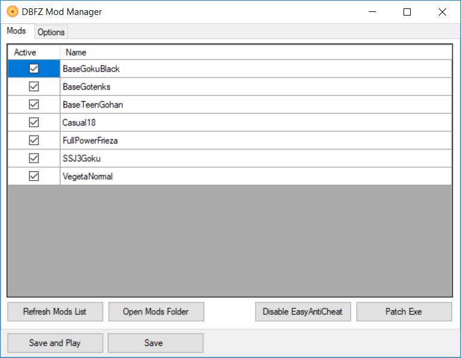
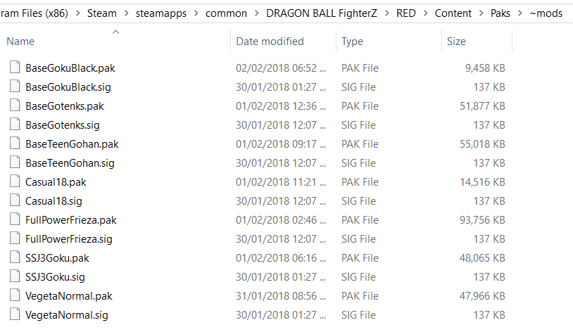

# DBFZ Mod Manager

A mod manager for Dragon Ball FighterZ.

## Disclaimer

Please use mods at your own risk and do not play online matches whilst mods are enabled!

## Patching the game

The game **must** be patched in order to install mods. 
To do this simply open the DBFZ Mod Manager and click `Disable EasyAntiCheat`, choose Dragon Ball FighterZ from the dropdown and click uninstall. 
After that click `Patch Exe` and you are all ready to go!

If you ever want to un-patch the game and play online again you can simply go into Steam and [Verify the integrity of the game files](https://support.steampowered.com/kb_article.php?ref=2037-QEUH-3335). 

## Installing Mods

Currently the best place to get mods for DBFZ is [gamebanana.com](https://gamebanana.com/skins/games/6246).

Once you download any mod you should see a `.pak` and a `.sig` file, depending on the mod these files might be stored a few folders deep. Once you have these files
Open the DBFZ Mod Manager and click `Open Mods Folder`, place both the `.pak` and `.sig` files in this folder. Click `Refresh Mods List` and the new mods should show up! 

Do not put mods into subfolders! Your mod directory should look something like this.

## Donate

Find this tool useful? Consider buying me a cup of coffee 😉
https://www.paypal.me/danielgriffithsdev
